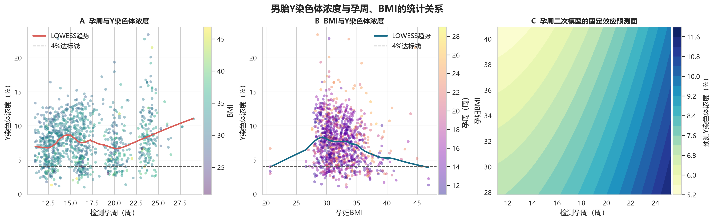
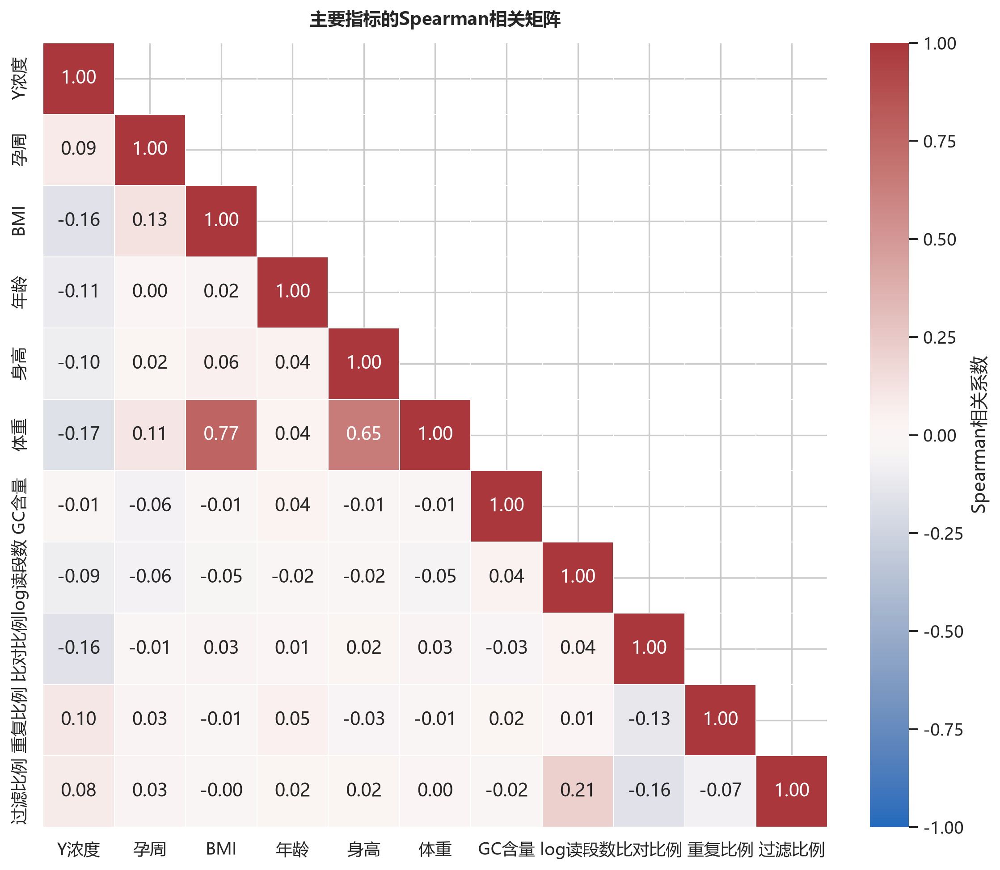
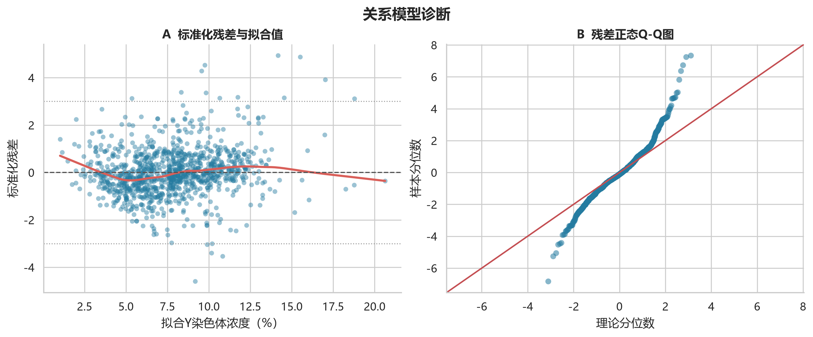

# C题第一问：胎儿 Y 染色体浓度的相关特性与关系模型

## 摘要

基于附件中的男胎检测数据，本文分析胎儿 Y 染色体浓度与检测孕周、孕妇 BMI 及其他指标的关系。考虑到同一孕妇存在多次检测、同一次采血还可能有技术复测，先将相同“孕妇代码 - 检测日期 - 抽血次数 - 孕周”的技术复测取均值，再以孕妇为随机效应建立线性混合效应模型。

结果表明：Y 染色体浓度随孕周显著上升，且上升速度随孕周增加而加快；在相同孕周下，BMI 越高，Y 染色体浓度越低。最终核心模型的总体似然比检验为 $\chi^2(3)=328.07$，$p=8.36\times10^{-71}$。孕周线性项、孕周二次项和 BMI 项均显著。模型固定效应解释约 13.5% 的变异，加入孕妇个体差异后解释约 77.7%，说明孕妇间异质性很强，不能只依赖简单相关系数或统一检测方案。

## 1. 数据预处理

数据来源为附件工作簿的“男胎检测数据”工作表。

1. 将“11w+6”等孕周统一转换为连续周数：

   $$G=\text{周数}+\frac{\text{天数}}{7}.$$

   同时兼容一条使用大写 `W` 的记录。

2. 将 Y 染色体浓度由比例转换为百分数。例如原值 0.04 转换为 4%，后续回归系数的单位均为“百分点”。

3. 对同一孕妇、同一检测日期、同一抽血次数和同一孕周的技术复测取均值，避免同一份血样被重复计权。原始 1082 行中共有 18 个检测事件包含 2 次技术复测，合并后得到 1064 个检测事件。

4. 同一孕妇在不同日期的多次检测作为纵向重复观测保留，并在模型中设置孕妇随机截距。

5. 主分析不主动删除极端值；另以 Y 浓度 1% 和 99% 分位数截尾后的样本进行稳健性检验。

数据概况如下：

| 项目 | 结果 |
|---|---:|
| 原始记录数 | 1082 |
| 孕妇数 | 267 |
| 合并技术复测后的检测事件数 | 1064 |
| 有多次有效检测的孕妇数 | 260 |
| 孕周，均值 ± 标准差 | 16.819 ± 4.070 周 |
| 孕周范围 | 11.0 - 29.0 周 |
| BMI，均值 ± 标准差 | 32.283 ± 2.978 |
| BMI 范围 | 20.703 - 46.875 |
| Y 浓度，均值 ± 标准差 | 7.752% ± 3.344% |
| Y 浓度范围 | 1.000% - 23.422% |

## 2. 相关特性

先计算 Pearson 线性相关和 Spearman 秩相关。由于这些相关系数暂未处理同一孕妇内的重复观测，它们只作为描述性证据，正式推断以混合效应模型为准。

| 指标 | Pearson $r$ | Pearson $p$ | Spearman $\rho$ | Spearman $p$ | 方向 |
|---|---:|---:|---:|---:|---|
| 孕周 | 0.1288 | $2.52\times10^{-5}$ | 0.0883 | 0.00394 | 正相关 |
| BMI | -0.1530 | $5.29\times10^{-7}$ | -0.1582 | $2.14\times10^{-7}$ | 负相关 |
| 体重 | -0.1806 | $3.00\times10^{-9}$ | -0.1671 | $4.15\times10^{-8}$ | 负相关 |
| 年龄 | -0.1141 | $1.93\times10^{-4}$ | -0.1144 | $1.84\times10^{-4}$ | 负相关 |
| 参考基因组比对比例 | -0.1094 | $3.50\times10^{-4}$ | -0.1595 | $1.69\times10^{-7}$ | 负相关 |
| 重复读段比例 | 0.0921 | 0.00263 | 0.1043 | $6.54\times10^{-4}$ | 弱正相关 |
| GC 含量 | -0.0148 | 0.629 | -0.0110 | 0.719 | 无明显单调关系 |

体重与 BMI 的 Spearman 相关系数为 0.77，存在明显共线性。因此核心关系模型只保留 BMI，不同时加入体重和身高，以避免系数不稳定。完整相关矩阵如下图。

散点图中的 LOWESS 曲线反映未校正的总体趋势。它混合了不同孕妇的基线差异，因此孕周的原始相关系数较弱；混合效应模型把“同一孕妇随孕周变化”和“不同孕妇基线不同”分离后，孕周效应明显增强。

## 3. 关系模型

### 3.1 模型设定

记第 $i$ 位孕妇第 $j$ 次检测的 Y 染色体浓度为 $Y_{ij}$，单位为百分数。令

$$g_{ij}=G_{ij}-16.8194,\qquad b_{ij}=BMI_{ij}-32.2831.$$

考虑随机截距模型：

$$Y_{ij}=\beta_0+\beta_1g_{ij}+\beta_2g_{ij}^2+\beta_3b_{ij}+u_i+\varepsilon_{ij},$$

其中 $u_i\sim N(0,\sigma_u^2)$ 表示第 $i$ 位孕妇不随检测时间改变的个体基线差异，$\varepsilon_{ij}\sim N(0,\sigma^2)$ 表示单次检测误差和未解释波动。

采用最大似然法比较线性、孕周二次、BMI 二次及交互模型。AIC 越小越优。

| 候选模型 | AIC | BIC | 结论 |
|---|---:|---:|---|
| 孕周二次 + BMI 线性 | **4818.36** | **4848.18** | 选用 |
| 孕周二次 + BMI 线性 + 交互 | 4819.64 | 4854.43 | 交互项未带来足够改进 |
| 孕周二次 + BMI 二次 | 4820.14 | 4854.93 | BMI 二次项无必要 |
| 孕周、BMI 线性 + 交互 | 4837.11 | 4866.93 | 拟合较差 |
| 孕周、BMI 均为线性 | 4837.42 | 4862.27 | 拟合较差 |

### 3.2 最终方程

估计得到：

$$
\boxed{
\widehat{Y}_{ij}=7.5023+0.27217g_{ij}+0.016913g_{ij}^{2}-0.14486b_{ij}+u_i
}
$$

其中 $Y$ 的单位为百分数，$g=\text{孕周}-16.8194$，$b=\text{BMI}-32.2831$。

| 变量 | 系数估计 | 标准误 | 95% 置信区间 | $p$ 值 |
|---|---:|---:|---:|---:|
| 截距 | 7.5023 | 0.1932 | [7.1236, 7.8810] | <0.001 |
| 孕周中心化值 $g$ | 0.27217 | 0.01837 | [0.23616, 0.30817] | $1.17\times10^{-49}$ |
| 孕周二次项 $g^2$ | 0.016913 | 0.003658 | [0.009742, 0.024083] | $3.78\times10^{-6}$ |
| BMI 中心化值 $b$ | -0.14486 | 0.05165 | [-0.24610, -0.04362] | 0.00504 |

总体显著性检验：相对于只有随机截距的空模型，似然比统计量为

$$\chi^2(3)=328.07,\qquad p=8.36\times10^{-71},$$

故拒绝“孕周和 BMI 对 Y 浓度均无解释力”的原假设。

### 3.3 系数解释

- 在平均孕周 16.819 周附近，孕周每增加 1 周，Y 浓度平均增加约 0.272 个百分点。
- 孕周二次项为正，说明上升速度随孕周增加而加快。模型给出的边际效应为

  $$\frac{\partial\widehat Y}{\partial G}=0.27217+0.033826(G-16.8194).$$

  例如，在 12、20、25 周附近，模型估计的每周增量分别约为 0.109、0.380、0.549 个百分点。
- 在孕周相同的条件下，BMI 每增加 1，Y 浓度平均下降约 0.145 个百分点；BMI 增加 5，平均下降约 0.724 个百分点。
- 未选入孕周与 BMI 的交互项，说明当前样本不足以证明 BMI 会显著改变“随孕周增长的斜率”。因此 BMI 主要表现为浓度基线的整体下移。

## 4. 其他指标与扩展检验

在核心模型基础上加入年龄、IVF 妊娠方式、GC 含量、原始读段数的对数、参考基因组比对比例、重复读段比例和过滤读段比例后：

- 孕周线性项仍显著，$p=1.27\times10^{-49}$；
- 孕周二次项仍显著，$p=1.12\times10^{-5}$；
- BMI 仍显著为负，$p=0.00543$；
- 年龄在多变量校正后不显著，$p=0.0719$；
- 妊娠方式、比对比例、重复比例和过滤比例均未达到 0.05 显著水平；
- GC 含量和原始读段数对数分别为 $p=0.0407$ 和 $p=0.00260$，提示测序质量或批次过程可能影响观测值，但它们更适合作为技术校正变量，不宜直接解释为生物学因果因素。

扩展模型并未改变孕周为正、BMI 为负的核心结论。由于核心模型更简洁、便于后续分组和时点建模，建议第一问正文采用核心模型，扩展结果作为稳健性说明。

## 5. 拟合优度与诊断

- 随机截距方差：$\widehat{\sigma}_u^2=8.231$；残差方差：$\widehat{\sigma}^2=2.866$。
- 组内相关系数 ICC = 0.742，说明约 74.2% 的条件剩余变异与孕妇个体基线差异有关。
- 边际 $R^2=0.135$：孕周和 BMI 固定效应解释约 13.5% 的总变异。
- 条件 $R^2=0.777$：加入孕妇个体随机效应后解释约 77.7% 的总变异。

残差 Q-Q 图呈现厚尾，Shapiro-Wilk 检验 $p<0.001$；共有 16 个检测事件的标准化残差绝对值大于 3。因此不能只依赖正态性假设下的单一检验结果。诊断图如下。

稳健性分析得到：

| 分析方法 | 孕周一次项 | 孕周二次项 | BMI 项 | 结论 |
|---|---:|---:|---:|---|
| 删除 Y 浓度两端各 1% 后的混合模型 | 0.2592，$p<10^{-46}$ | 0.01373，$p=1.06\times10^{-4}$ | -0.1551，$p=0.00167$ | 方向与显著性不变 |
| 按孕妇聚类稳健标准误的 OLS | 0.0975，$p=0.00122$ | 0.01145，$p=0.0299$ | -0.1965，$p=0.00326$ | 方向与显著性不变 |

因此核心结论不由少数异常值或单一标准误设定驱动。

## 6. 第一问结论

1. 胎儿 Y 染色体浓度与孕周显著正相关，且呈显著的向上弯曲趋势；越到较晚孕周，浓度的平均增长速度越快。
2. 控制孕周及同一孕妇内的重复检测后，BMI 与 Y 染色体浓度仍显著负相关；高 BMI 孕妇在相同孕周下通常具有更低的 Y 浓度。
3. 孕妇个体差异很大，ICC 达 0.742。简单总体散点趋势会掩盖孕周效应，因此需要混合效应模型，而不能把 1064 次检测当作彼此独立。
4. 年龄、体重等指标存在一定边际相关，但体重与 BMI 高度相关，年龄在多变量模型中不显著。部分测序质量指标与 Y 浓度存在弱关联，应作为技术校正因素而不是主要生物学解释变量。
5. 推荐将上述“孕周二次 + BMI 线性 + 孕妇随机截距”模型作为第二、三问确定达标时间和最优 NIPT 时点的基础关系模型；但 4% 达标概率还需显式加入个体随机效应和检测误差，不能只用固定效应均值直接判定。

## 7. 可复现文件

- Python 分析脚本：`../../question1_analysis.py`
- 清洗后的检测事件数据：`question1_clean_episode_data.csv`
- 相关系数表：`question1_correlations.csv`
- 候选模型比较：`question1_model_comparison.csv`
- 最终模型系数：`question1_coefficients.csv`
- 扩展模型系数：`question1_extended_coefficients.csv`
- 汇总结果：`question1_summary.json`

