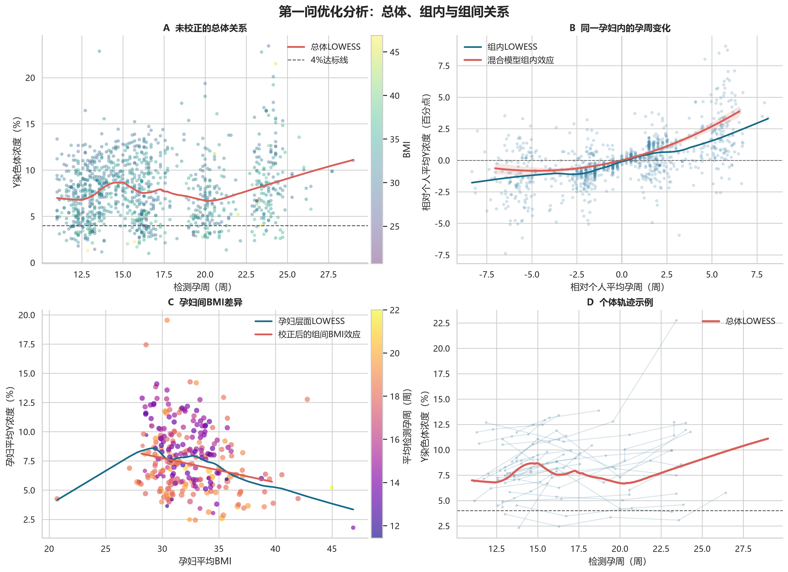
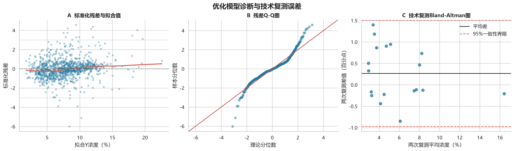

# C题第一问优化报告：胎儿 Y 染色体浓度的相关特性与纵向关系模型

## 摘要

针对男胎 NIPT 数据中同一孕妇多次抽血、同一次抽血可能重复测序的结构，本文将问题一视为纵向重复测量问题，而不是普通横截面回归问题。首先把相同“孕妇代码 - 检测日期 - 抽血次数 - 孕周”的技术复测取均值，将 1082 条原始记录整理为 1064 个检测事件，涉及 267 位孕妇。随后把孕周和 BMI 分解为“同一孕妇内的变化”与“不同孕妇之间的差异”，建立带随机截距和孕周随机斜率的组内-组间混合效应模型。

优化模型的 AIC 为 4512.36，明显低于普通随机截距模型的 4818.36。结果表明：同一孕妇的孕周每增加 1 周，Y 染色体浓度在其个人平均检测孕周附近平均增加 0.352 个百分点，且增长速度随孕周增加而加快；不同孕妇之间，平均 BMI 每增加 1，Y 浓度平均下降 0.208 个百分点。孕期内同一孕妇 BMI 的小幅变化不显著。模型固定效应解释约 21.0% 的总变异，加入孕妇个体基线和增长斜率差异后解释约 86.0%。GEE、正常妊娠子样本和技术复测分析均支持主要结论。

## 1. 问题分析

题目要求分析胎儿 Y 染色体浓度与孕妇孕周、BMI 等指标的相关特性，建立关系模型并检验显著性。附件数据具有三个重要特征：

1. 同一孕妇可能在不同孕周多次抽血，观测值并不独立；
2. 同一次抽血可能重复测序，属于技术复测；
3. 较早检测浓度偏低的孕妇可能更容易接受后续检测，检测时点可能具有选择性。

因此，若直接使用普通多元线性回归，会低估标准误，并混淆以下两种关系：

- **组内关系**：同一孕妇随着孕周增加，Y 浓度如何变化；
- **组间关系**：检测时间、BMI 不同的孕妇之间，Y 浓度有何差异。

本报告采用组内-组间混合效应模型分离这两类效应，并允许不同孕妇具有不同的浓度基线和增长速度。

## 2. 数据预处理

### 2.1 数据选择与变量转换

仅使用附件中的“男胎检测数据”，因为女胎数据没有 Y 染色体浓度。主要变量包括：

- 因变量：Y 染色体浓度，原始单位为比例，统一乘以 100 转换为百分数；
- 核心解释变量：检测孕周、孕妇 BMI；
- 辅助变量：年龄、妊娠方式、GC 含量、原始读段数、比对比例、重复比例和过滤比例等。

将“11w+6”等孕周转换为连续周数：

$$
G=\text{周数}+\frac{\text{天数}}{7}.
$$

### 2.2 技术复测处理

相同孕妇、相同检测日期、相同抽血次数和相同孕周的多条记录视为同一检测事件，对数值指标取均值。这样既保留不同孕周的纵向信息，又避免同一份血样被重复计权。

| 项目 | 结果 |
|---|---:|
| 原始记录数 | 1082 |
| 孕妇数 | 267 |
| 合并后的检测事件数 | 1064 |
| 存在多次有效检测的孕妇数 | 260 |
| 含技术复测的检测事件数 | 18 |
| 技术复测最大次数 | 2 |
| 孕周均值 ± 标准差 | 16.819 ± 4.070 周 |
| 孕周范围 | 11.0 - 29.0 周 |
| BMI 均值 ± 标准差 | 32.283 ± 2.978 |
| BMI 范围 | 20.703 - 46.875 |
| Y 浓度均值 ± 标准差 | 7.752% ± 3.344% |
| Y 浓度范围 | 1.000% - 23.422% |

## 3. 探索性分析

未校正散点图显示，Y 浓度总体随孕周上升、随 BMI 增大而下降，但总体 LOWESS 曲线存在局部波动。这些波动既可能来自个体差异，也可能来自低浓度孕妇被选择性复测，因此不能只依据总体散点趋势判断纵向关系。

下图分别展示未校正总体关系、同一孕妇内的孕周变化、孕妇间 BMI 差异和部分个体轨迹。

图 B 中，在去除每位孕妇自己的平均浓度后，孕周增加与 Y 浓度上升的关系更加清楚。图 D 也表明不同孕妇的起点和增长速度存在明显差异，因此需要同时设置随机截距和随机斜率。

## 4. 模型建立

### 4.1 组内与组间变量

记第 $i$ 位孕妇第 $j$ 次检测的 Y 浓度为 $Y_{ij}$，检测孕周为 $G_{ij}$，BMI 为 $B_{ij}$。定义：

$$
\Delta G_{ij}=G_{ij}-\bar G_i,
\qquad
G_i^{B}=\bar G_i-\bar G,
$$

$$
\Delta B_{ij}=B_{ij}-\bar B_i,
\qquad
B_i^{B}=\bar B_i-\bar B.
$$

其中：

- $\Delta G_{ij}$ 表示本次检测孕周相对该孕妇个人平均检测孕周的变化；
- $G_i^{B}$ 表示该孕妇平均检测时点相对总体平均时点的差异；
- $\Delta B_{ij}$ 表示同一孕妇孕期内 BMI 的变化；
- $B_i^{B}$ 表示该孕妇平均 BMI 相对总体平均 BMI 的差异。

### 4.2 随机斜率混合效应模型

建立模型：

$$
\begin{aligned}
Y_{ij}={}&\beta_0+\beta_1\Delta G_{ij}
+\beta_2(\Delta G_{ij})^2+\beta_3G_i^{B}\\
&+\beta_4\Delta B_{ij}+\beta_5B_i^{B}
+u_{0i}+u_{1i}\Delta G_{ij}+\varepsilon_{ij}.
\end{aligned}
$$

其中 $u_{0i}$ 表示孕妇个体基线差异，$u_{1i}$ 表示个体增长斜率差异，$\varepsilon_{ij}$ 表示单次检测误差和其他未解释波动。

模型假设为：

$$
\begin{pmatrix}u_{0i}\\u_{1i}\end{pmatrix}
\sim N\left(
\begin{pmatrix}0\\0\end{pmatrix},
\Sigma_u
\right),
\qquad
\varepsilon_{ij}\sim N(0,\sigma^2).
$$

## 5. 模型选择

先使用最大似然法比较固定效应和随机效应结构，AIC、BIC 越小表示拟合效果与模型复杂度的综合表现越好。

| 模型 | 结构 | AIC | BIC |
|---|---|---:|---:|
| M1 | 全局孕周、BMI + 随机截距 | 4818.36 | 4848.18 |
| M2 | 全局孕周、BMI + 随机截距、随机斜率 | 4637.20 | 4676.96 |
| M3 | 组内-组间分解 + 随机截距 | 4702.28 | 4742.04 |
| M4 | 组内-组间分解 + 随机截距、随机斜率 | **4512.36** | **4562.06** |

M4 的 AIC 比原随机截距模型降低约 306，说明分离组内、组间效应并允许个体斜率不同，能显著改善模型。确定结构后，采用限制最大似然法重新估计最终参数。

## 6. 最终关系模型与显著性

### 6.1 最终方程

最终固定效应关系为：

$$
\boxed{
\begin{aligned}
\widehat Y_{ij}={}&7.26498
+0.35180\Delta G_{ij}
+0.037115(\Delta G_{ij})^2\\
&-0.40188G_i^{B}
-0.02092\Delta B_{ij}
-0.20820B_i^{B}\\
&+u_{0i}+u_{1i}\Delta G_{ij}.
\end{aligned}}
$$

Y 浓度的单位为百分数，因此系数单位为百分点。

### 6.2 参数估计

| 变量 | 系数 | 标准误 | 95% 置信区间 | $p$ 值 |
|---|---:|---:|---:|---:|
| 截距 | 7.26498 | 0.16684 | [6.93797, 7.59198] | <0.001 |
| 组内孕周差 $\Delta G$ | 0.35180 | 0.02521 | [0.30239, 0.40121] | $2.93\times10^{-44}$ |
| 组内孕周二次项 $(\Delta G)^2$ | 0.037115 | 0.003529 | [0.030199, 0.044031] | $7.10\times10^{-26}$ |
| 组间平均检测孕周 $G^B$ | -0.40188 | 0.07264 | [-0.54424, -0.25951] | $3.15\times10^{-8}$ |
| 组内 BMI 差 $\Delta B$ | -0.02092 | 0.09651 | [-0.21008, 0.16825] | 0.828 |
| 组间平均 BMI $B^B$ | -0.20820 | 0.05152 | [-0.30918, -0.10722] | $5.32\times10^{-5}$ |

### 6.3 联合显著性检验

在保持相同随机效应结构的条件下，采用似然比检验：

| 检验对象 | LR 统计量 | 自由度 | $p$ 值 |
|---|---:|---:|---:|
| 全部固定效应 | 322.13 | 5 | $1.75\times10^{-67}$ |
| 组内孕周一次和二次项 | 235.09 | 2 | $8.93\times10^{-52}$ |
| 组间平均检测孕周 | 29.11 | 1 | $6.82\times10^{-8}$ |
| BMI 组内与组间项 | 16.14 | 2 | $3.12\times10^{-4}$ |

因此，孕周和 BMI 对 Y 浓度均具有总体统计解释力，但 BMI 的作用主要来自孕妇之间的差异。

## 7. 结果解释

### 7.1 孕周效应

同一孕妇的组内孕周边际效应为：

$$
\frac{\partial\widehat Y}{\partial G}
=0.35180+0.07423\Delta G.
$$

当本次检测孕周等于该孕妇个人平均检测孕周时，孕周每增加 1 周，Y 浓度平均增加约 0.352 个百分点。二次项显著为正，说明在主要观测区间内，Y 浓度的增长速度随孕周增加而加快。

组间平均检测孕周系数为负，不能解释为“孕周增加导致浓度下降”。它表示平均检测时间较晚的孕妇，其整体浓度基线反而较低。这与低浓度孕妇更容易在较晚孕周继续接受复测的选择性检测机制相一致，说明检测安排并非完全随机。

### 7.2 BMI 效应

同一孕妇孕期内 BMI 的小幅变化不显著，$p=0.828$；但不同孕妇之间的平均 BMI 差异显著。控制检测时点和个体差异后，平均 BMI 每增加 1，Y 浓度平均下降约 0.208 个百分点。平均 BMI 相差 5 时，预计浓度相差约 1.04 个百分点。

因此，BMI 更适合视为孕妇层面的体型特征，而不宜把短期体重变化解释成 Y 浓度变化的直接原因。这一结论也支持后续问题按孕妇 BMI 水平进行分组。

### 7.3 个体差异

随机截距方差为 6.529；随机孕周斜率的标准差换算为约 0.264 个百分点/周；残差方差为 1.588。说明不同孕妇不仅起始浓度不同，随孕周增加的速度也有较大差异。

- 边际 $R^2=0.210$：固定效应解释约 21.0% 的总变异；
- 条件 $R^2=0.860$：加入孕妇个体基线和斜率差异后解释约 86.0% 的总变异。

这说明统一浓度曲线只能表示总体平均趋势，个体化 NIPT 时点还需要考虑随机效应和测量误差。

## 8. 年龄、妊娠方式和测序质量指标

在主模型中进一步加入年龄、IVF 妊娠方式、GC 含量、原始读段数对数、比对比例、重复比例和过滤比例后，组内孕周项、孕周二次项、组间检测时点及组间 BMI 仍保持原方向和显著性，说明核心结果稳定。

扩展模型结果为：

- 年龄不显著，$p=0.103$；
- IUI 和 IVF 相对自然受孕均不显著，$p$ 分别为 0.478 和 0.317；
- GC 含量和原始读段数对数显著，$p$ 分别为 0.00540 和 0.000940；
- 比对比例、重复比例和过滤比例均不显著，$p>0.36$。

GC 含量和读段数属于测序过程指标，其显著性提示观测浓度受到一定技术过程影响，不应直接解释为生物学因果效应。后续达标概率模型应将它们作为技术校正或误差来源。

## 9. 稳健性与敏感性分析

### 9.1 GEE 稳健标准误

采用交换相关结构的 GEE 对总体孕周和 BMI 关系进行复核，得到：

| 变量 | 系数 | $p$ 值 |
|---|---:|---:|
| 孕周一次项 | 0.27338 | $1.71\times10^{-33}$ |
| 孕周二次项 | 0.01695 | $1.34\times10^{-5}$ |
| BMI | -0.14171 | 0.0132 |

在不依赖混合模型正态标准误的情况下，孕周为正、BMI 为负的结论仍然成立。

### 9.2 正常妊娠子样本

排除胎儿不健康和染色体非整倍体记录后，剩余 910 个检测事件、256 位孕妇。优化模型得到：

- 组内孕周一次项 0.35671，$p=8.90\times10^{-41}$；
- 组内孕周二次项 0.03661，$p=2.65\times10^{-22}$；
- 组间平均 BMI 项 -0.21743，$p=3.35\times10^{-5}$；
- 组内 BMI 项仍不显著，$p=0.950$。

主要结论不由异常胎儿记录驱动。

### 9.3 首次检测子样本

每位孕妇仅保留首次检测后共有 267 条记录，孕周范围为 11-22 周。横截面模型中孕周一次项和二次项均不显著，而 BMI 仍显著为负，系数为 -0.238，$p=4.54\times10^{-5}$。

首次检测的孕周并非随机安排，且孕周范围较窄，因此这一结果不能否定同一孕妇内的纵向增长效应；相反，它说明仅依靠不同孕妇之间的单次横截面比较，难以识别真实的孕周变化规律。

## 10. 技术复测误差与模型诊断

18 对技术复测结果显示：

| 指标 | 结果 |
|---|---:|
| 两次复测平均差 | 0.268 个百分点 |
| 平均绝对差 | 0.546 个百分点 |
| 单次测量误差标准差估计 | 0.447 个百分点 |
| 最大绝对差 | 1.399 个百分点 |
| 95% 一致性界限 | [-0.970, 1.505] 个百分点 |

0.447 个百分点的测量误差相对于 BMI 效应并不小。例如平均 BMI 相差 2 时，模型给出的浓度差约为 0.416 个百分点，与单次测量误差处于同一量级。因此第二、三问不能把观测浓度是否超过 4% 当成完全无误差的确定事件。

残差仍存在明显厚尾，Shapiro-Wilk 检验 $p=8.64\times10^{-22}$，共有 21 个检测事件的标准化残差绝对值超过 3。由于样本量较大，正态性检验会非常敏感；但尾部偏离确实存在，因此报告同时使用了 GEE 稳健检验，并建议后续采用按孕妇聚类的 Bootstrap 置信区间。

## 11. 模型局限性

1. 数据主要来自高 BMI 孕妇，低 BMI 区间样本较少，不宜向样本支持范围外外推；
2. 检测时点可能受早期浓度影响，存在选择性复测，组间检测时点系数不能作生物学因果解释；
3. 技术复测只有 18 对，测量误差估计仍有较大不确定性；
4. 混合模型描述的是总体平均规律和个体偏差，不等同于临床因果模型；
5. 第一问分析连续浓度，不能仅用固定效应预测值直接确定个体首次达到 4% 的时间。

## 12. 第一问结论

1. 胎儿 Y 染色体浓度在同一孕妇内随孕周显著上升，并呈加速增长特征；
2. BMI 对 Y 浓度的负向作用主要体现为孕妇之间的体型差异：平均 BMI 越高，Y 浓度整体越低；
3. 孕妇之间的浓度基线和孕周增长速度差异显著，随机斜率模型明显优于统一斜率模型；
4. 平均检测时点的负向组间效应提示存在选择性复测，普通横截面回归会混淆检测安排与生物学变化；
5. 测序 GC 含量、读段数和约 0.447 个百分点的技术误差会影响观测浓度，应在后续达标概率分析中加以校正；
6. 第二、三问宜将最后一次低于 4% 与第一次达到 4% 之间视为达标时间区间，建立区间删失或离散时间风险模型，而不应简单求固定效应曲线与 4% 的交点。

## 13. 可复现文件

- 优化分析程序：`../../question1_optimized_analysis.py`
- 模型比较：`optimized_model_comparison.csv`
- 主模型系数：`optimized_main_coefficients.csv`
- 扩展模型系数：`optimized_extended_coefficients.csv`
- 正常妊娠敏感性系数：`optimized_normal_subset_coefficients.csv`
- 技术复测数据：`optimized_technical_replicates.csv`
- 汇总结果：`optimized_summary.json`

