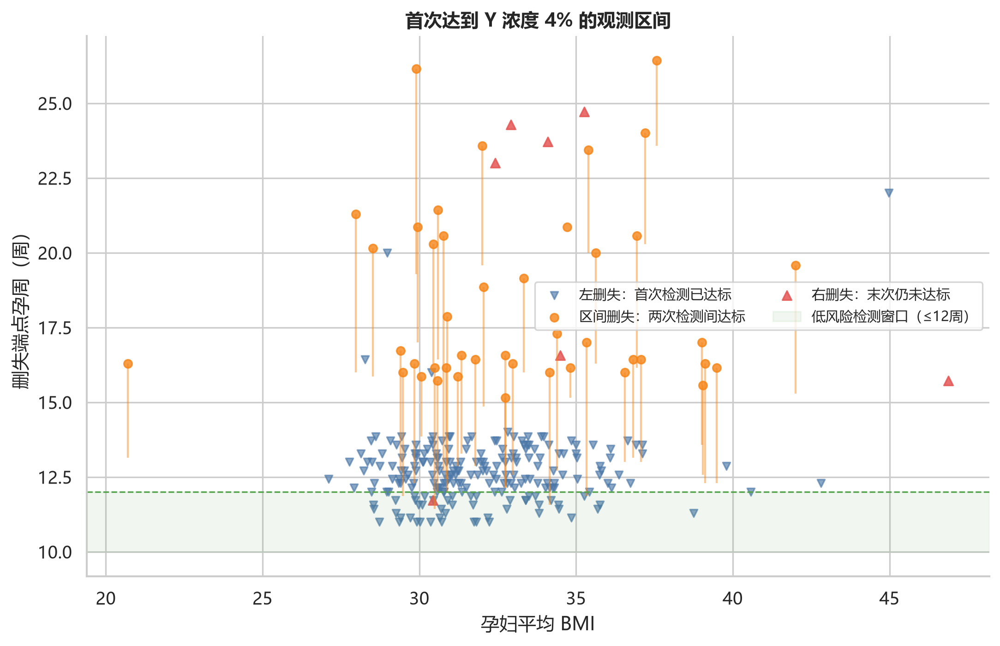
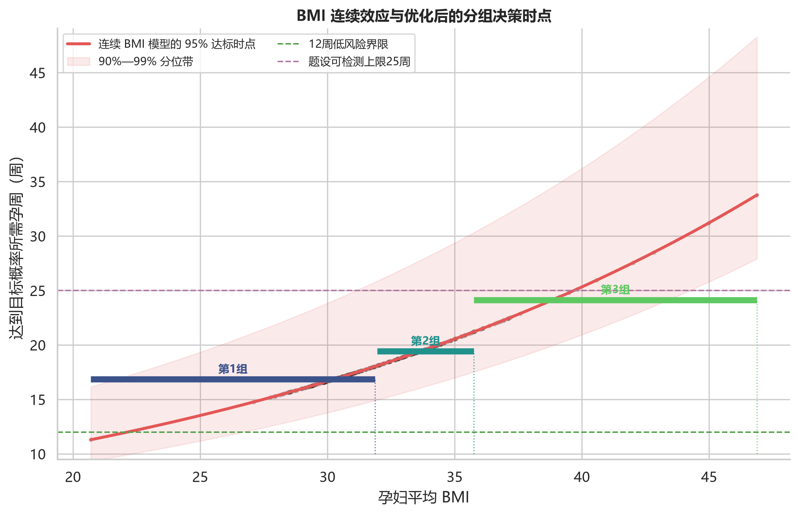
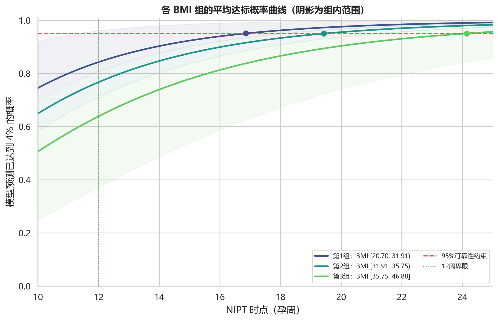
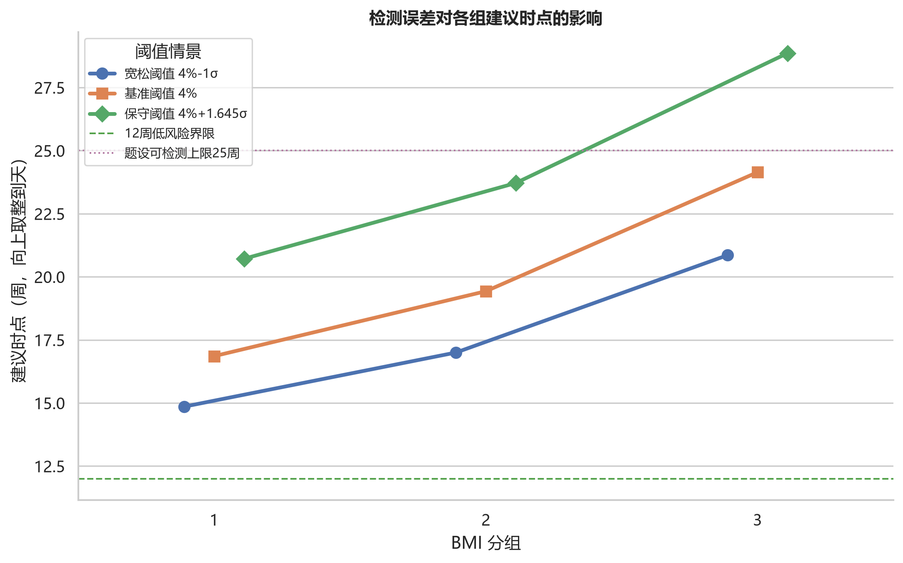

# C题第二问报告：基于区间删失 AFT 模型的 BMI 分组与最佳 NIPT 时点

## 摘要

针对“Y 染色体浓度首次达到 4%”这一事件，本文没有把第一次观测到达标的孕周直接视为真实达标时间，而是根据每位孕妇的纵向检测记录构造左删失、区间删失和右删失数据，并采用参数化加速失效时间（AFT）模型估计达标时间分布。共有 267 位男胎孕妇进入分析，其中左删失 217 人、区间删失 43 人、右删失 7 人。

主决策采用“**组内平均达标概率达到 95% 的最早孕周**”：在控制组内平均未达标概率不超过 5% 的前提下，把检测安排得尽可能早，从而避免任意设定医学风险权重。无约束 AIC 最低模型在稀疏 BMI 尾部产生不合理 U 形和严重外推，因此决策模型按方向一致性与稳定性选择 对数正态 AFT（BMI 线性项）。再对连续 BMI 对应的 95% 达标时点作带最小组容量约束的一维动态规划分段，选择 3 组。最终建议见表 5；检测误差分析表明，靠近 4% 阈值的记录会使分组时点发生变化，因此临床执行应优先采用保守阈值或在临界结果时复测。

## 1. 题意审查与建模选择

题目要求按 BMI 分组，并给出使潜在风险最小的 NIPT 时点。这里同时存在两类相反风险：

- 检测过早：Y 浓度尚未达到 4%，增加结果不可靠或重复抽血的可能；
- 检测过晚：异常胎儿被发现得更晚，题设指出 12 周及以前风险较低，13—27 周风险较高，28 周以后风险极高。

若直接采用“每位孕妇第一次测到 ≥4% 的孕周”，会产生三类偏差：首次样本已达标者的真实达标时间其实更早；从未达标者不能被删除；两次检测之间何时达标未知。此外，本数据有选择性复测，检测时点本身并非随机。因此，本问最合适的统计对象是潜在首次达标时间 $T$，并使用区间删失生存模型。

本文把“风险最小”写为以下约束优化：

$$
t_g^*=\min_t t,
\qquad
\text{s.t.}\quad E_{B\mid g}[P(T\le t\mid BMI=B)]\ge 0.95.
$$

也就是说，要求第 $g$ 个 BMI 组按其经验 BMI 分布平均后，到建议时点至少有 95% 的概率已经达到 4%；在满足可靠性的可行时点中选最早者。这里不用“组内最极端 BMI 必须达到 95%”作为主约束，因为高 BMI 尾部样本很少，单个极端值会把整组建议推到题设 25 周范围之外；报告仍单独列出极端边界最低概率作为风险提示。该定义无需人为指定“检测失败”和“延迟发现”孰轻孰重，且可直接做 90%、99% 可靠性敏感性分析。

## 2. 数据整理与删失区间

沿用第一问的数据清洗：仅使用“男胎检测数据”，把 Y 染色体浓度由比例转换为百分数；将相同“孕妇代码—检测日期—抽血次数—孕周”的技术复测取均值。1082 条原始记录合并为 1064 个有效检测事件，涉及 267 位孕妇。每位孕妇用各次有效检测 BMI 的均值作为分组指标。

对阈值 $c=4\%$，删失区间定义如下：

1. 第一次有效检测已经 $Y\ge c$：$T\le U_i$，记为左删失；
2. 某次 $Y<c$，下一次首次出现 $Y\ge c$：$L_i<T\le U_i$，记为区间删失；
3. 截至最后一次仍未达到 $c$：$T>L_i$，记为右删失。

| 删失类型 | 人数 | 含义 |
|---|---:|---|
| 左删失 | 217 | 首次检测时已经达标，真实达标时间更早 |
| 区间删失 | 43 | 首次达标发生在相邻两次检测之间 |
| 右删失 | 7 | 末次检测仍未达标，只知道真实时间更晚 |

图中的点不是所有人的“真实首次达标周”，而是可由数据确认的上界或下界。左删失占比较高，意味着高分位时点的不确定性不能只由常规回归标准误表示，故后文给出按孕妇重抽样的 Bootstrap 区间。

## 3. 区间删失 AFT 模型

### 3.1 模型形式

令 $B_i$ 为第 $i$ 位孕妇的平均 BMI，标准化后为 $z_i$。AFT 模型写为：

$$
\log T_i=\eta_i+\varepsilon_i,
\qquad
\eta_i=\beta_0+\beta_1z_i+\beta_2z_i^2,
$$

其中是否保留 $z_i^2$ 由 AIC 决定；误差分布分别尝试对数正态、Weibull 和对数 Logistic。三类观测对似然的贡献分别为：

$$
F(U_i\mid B_i),\qquad
F(U_i\mid B_i)-F(L_i\mid B_i),\qquad
1-F(L_i\mid B_i).
$$

这使首次已达标者和末次仍未达标者都能进入估计，而无需伪造事件时间。

### 3.2 模型比较

| 候选模型 | 负对数似然 | AIC | BIC |
|---|---:|---:|---:|
| 对数Logistic AFT（BMI 二次） | 200.97 | 409.94 | 424.28 |
| 对数正态 AFT（BMI 二次） | 201.16 | 410.32 | 424.67 |
| Weibull AFT（BMI 二次） | 202.02 | 412.03 | 426.38 |
| 对数正态 AFT（BMI 线性） | 203.21 | 412.42 | 423.18 |
| 对数Logistic AFT（BMI 线性） | 203.22 | 412.44 | 423.20 |
| Weibull AFT（BMI 线性） | 203.73 | 413.46 | 424.22 |

无约束最小 AIC 模型为 **对数Logistic AFT（BMI 二次项）**；但它只比所选模型低 2.48，却在低 BMI 端产生与第一问及稀释机理相反的 U 形，并使 BMI=46.88 的 95% 时点外推至 58 周，明显超出题设 10—25 周范围。因而不以微小拟合改善换取严重决策不稳定，最终在 BMI 线性、方向单调的候选模型中按 AIC 选择 **对数正态 AFT（BMI 线性项）**。优化参数依次为 `2.04659、0.12709、0.64533`。参数作用在标准化 BMI 与对数时间尺度上，实际解释和决策均通过 $F(t\mid BMI)$ 与时间分位数完成。

## 4. BMI 分组优化

### 4.1 分组原则

先计算每位孕妇在连续 BMI 模型下的 95% 达标时间 $t_{0.95}(B_i)$，然后按 BMI 排序，用动态规划寻找使组内 $t_{0.95}$ 平方误差最小的连续分段；每组至少 30 人，以防极端 BMI 小样本形成不稳定小组。考察 1—6 组，选择达到“从 1 组到最大可行组总改善量的 90%”的最小组数。

| 组数K | 组内平方误差 | 相对最大改善率 |
|---|---:|---:|
| 1 | 1748.4081 | 0.0% |
| 2 | 761.3259 | 68.9% |
| 3 | 437.7292 | 91.5% |
| 4 | 368.9655 | 96.3% |
| 5 | 329.9990 | 99.1% |
| 6 | 316.4943 | 100.0% |

据此选取 **3 组**。切点取相邻两组边界样本 BMI 的中点。每组实际时点通过组内所有样本 BMI 的预测达标概率取平均并求解 95% 交点，再向上取整到整天。这样得到的是可执行的群体排期规则；表中同时列出极端边界的最低概率，提醒尾部个体不能机械套用群体平均保证。

### 4.2 最佳 NIPT 时点

| 组别 | 人数 | BMI 区间 | 最佳 NIPT 时点 | 组内平均达标概率 | 极端边界最低概率 | 时点95%CI下限/周 | 时点95%CI上限/周 |
|---|---:|---:|---:|---:|---:|---:|---:|
| 1 | 139 | [20.70, 31.91) | 16周+6天 | 95.1% | 93.5% | 14.29 | 18.65 |
| 2 | 98 | [31.91, 35.75) | 19周+3天 | 95.0% | 93.0% | 16.88 | 22.54 |
| 3 | 30 | [35.75, 46.88] | 24周+1天 | 95.1% | 84.3% | 18.66 | 32.74 |

表中 BMI 区间是本样本实际覆盖范围；超出 20.70—46.88 的孕妇属于外推，不宜机械套用。Bootstrap 区间由 200 次有效孕妇级重抽样给出，反映删失构造和样本组成的不确定性。临床排期时，若希望对模型不确定性也采取保守原则，可参考置信区间上限，而不是只用点估计。

图中实线是组内平均达标概率，阴影表示该 BMI 组从最低到最高预测概率的范围，实心点为建议时点。建议时点是群体层面的统计决策，不等同于对单个孕妇的诊断保证。

### 4.3 可靠性水平敏感性

95% 是主分析的管理约束，并非题目给定常数。为避免把这一选择隐藏在模型中，下表同时给出 90% 和 99% 的排期；“25周内不可满足”表示模型交点超出题设 NIPT 时间窗，此时不能继续延后机械等待，而应在 25 周前检测并预设复测或采用其他临床方案。

| 组别 | 目标90% | 目标95% | 目标99% |
|---|---:|---:|---:|
| 1 | 14周+0天 | 16周+6天 | 24周+1天 |
| 2 | 16周+1天 | 19周+3天 | 25周内不可满足（交点27周+6天） |
| 3 | 19周+6天 | 24周+1天 | 25周内不可满足（交点35周+0天） |

## 5. 检测误差对结果的影响

第一问利用 18 组同一样本技术复测估得单次检测误差标准差约为 $\sigma_e=0.447$ 个百分点。当前数据中有 77 个检测事件位于 $4\%\pm\sigma_e$ 内，且有 34 位孕妇出现“先达到 4%、随后又低于 4%”的反向波动。这说明真实生物学趋势虽总体随孕周上升，单次观测却并不单调；硬阈值会把微小测量波动放大为达标状态改变。

采用三个阈值情景重新构造删失区间并重估同类型 AFT 模型：

- 宽松情景：$4\%-\sigma_e=3.553\%$；
- 基准情景：$4.000\%$；
- 保守情景：$4\%+1.645\sigma_e=4.735\%$。若误差近似正态，观测值达到该保守阈值时，其单侧 95% 下置信界才达到 4%。

| 组别 | 保守阈值 4%+1.645σ | 基准阈值 4% | 宽松阈值 4%-1σ |
|---|---:|---:|---:|
| 1 | 20周+5天 | 16周+6天 | 14周+6天 |
| 2 | 23周+5天 | 19周+3天 | 17周+0天 |
| 3 | 25周内不可满足（交点28周+6天） | 24周+1天 | 20周+6天 |

误差影响主要通过两条路径进入结果：一是改变某次检测是否跨过 4% 的分类，进而改变删失类型和区间；二是高 BMI 组本身达标较晚，阈值上调后延迟可能更明显。实际执行建议如下：

1. 若在建议时点测得的 Y 浓度明显高于 4%，按常规流程处理；
2. 若结果落在 $4\%\pm0.447\%$ 附近，不应仅凭一次硬判定，宜结合测序质量指标并复测；
3. 若决策目标强调“尽量避免假达标”，采用保守情景时点；若强调尽早筛查，可用基准时点但预留复测方案；
4. 对 BMI 极端值、IVF 或其他高风险个体，应由临床人员结合个体情况调整，而不是只依据 BMI 分组。

## 6. 自我审查与局限性

1. **观察计划具有选择性。** 浓度较低者更可能复测，检测间隔也不统一。区间删失模型正确利用了已观察区间，但仍假设给定 BMI 后观察计划不携带额外的未建模信息。
2. **潜在达标过程被视为单次穿越。** 有 34 人出现观测反转，说明测量误差和短期波动存在。阈值敏感性分析缓解但不能完全消除这一问题。
3. **BMI 使用孕期检测均值。** 这适合对孕妇作稳定分组，但会掩盖孕期 BMI 小幅变化。第一问结果显示组间 BMI 效应明显、组内 BMI 变化不显著，因此该处理在本数据中较合理。
4. **95% 是决策可靠性水平，不是医学界统一阈值。** 报告同时保留模型函数，可根据管理部门容许的失败概率改成 90% 或 99%；可靠性要求越高，建议时点越晚。
5. **高分位估计受右删失样本数限制。** 只有 7 位孕妇末次仍未达标，95% 分位的尾部外推依赖分布假设。模型比较和 Bootstrap 能揭示部分不确定性，但不能代替外部验证。
6. **本结果只在样本 BMI 范围内成立。** 超出样本范围、数据量很少的尾部区间或不同检测平台需要重新校准。
7. **群体约束不保证每个极端个体。** 第 3 组的平均达标率达到 95%，但 BMI 上边界的最低预测概率较低，因此极端高 BMI 个体应采用单独概率计算和复测策略。

## 7. 结论

第二问最关键的改进，是把“首次达到 4%”作为带左删失、区间删失和右删失的潜在事件时间，而不是把第一次测到达标的孕周当作精确值。综合拟合、方向一致性和尾部稳定性后采用 对数正态 AFT（BMI 线性项）；基于其连续 BMI—达标时间关系，经动态规划形成 3 个连续 BMI 组，并在各组内选择平均达标概率至少为 95% 的最早时点。表 5 给出的时点兼顾检测可靠性与尽早筛查，表 6 则量化了检测误差下的调整范围。

对临床执行而言，建议采用“基准时点 + 临界结果复测”的方案；若更重视避免假达标，则采用 $4\%+1.645\sigma_e$ 的保守时点。任何分组时点都应视为基于本样本的群体排期建议，而非个体诊断结论。
