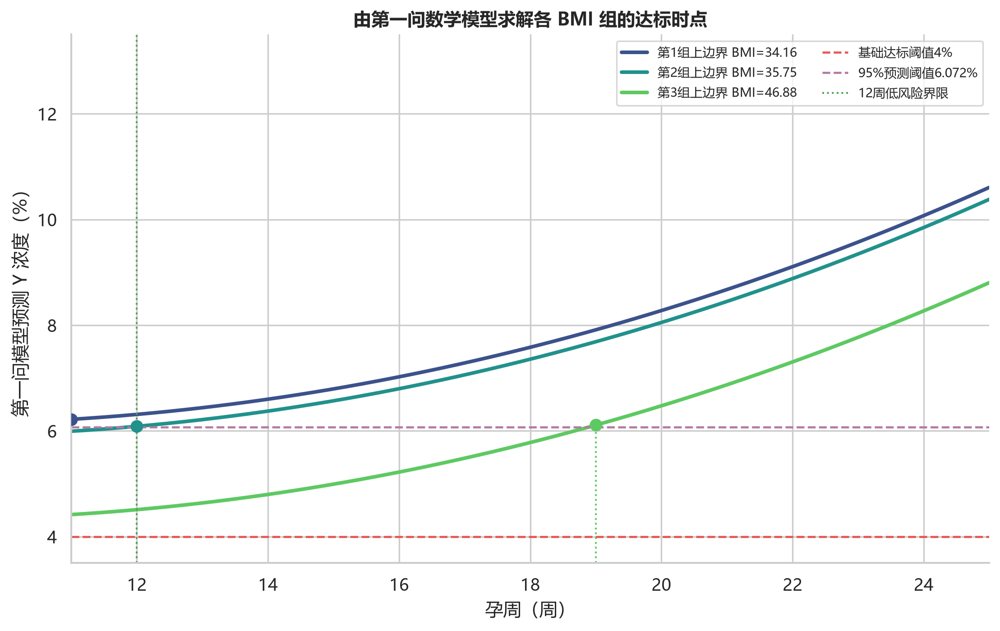
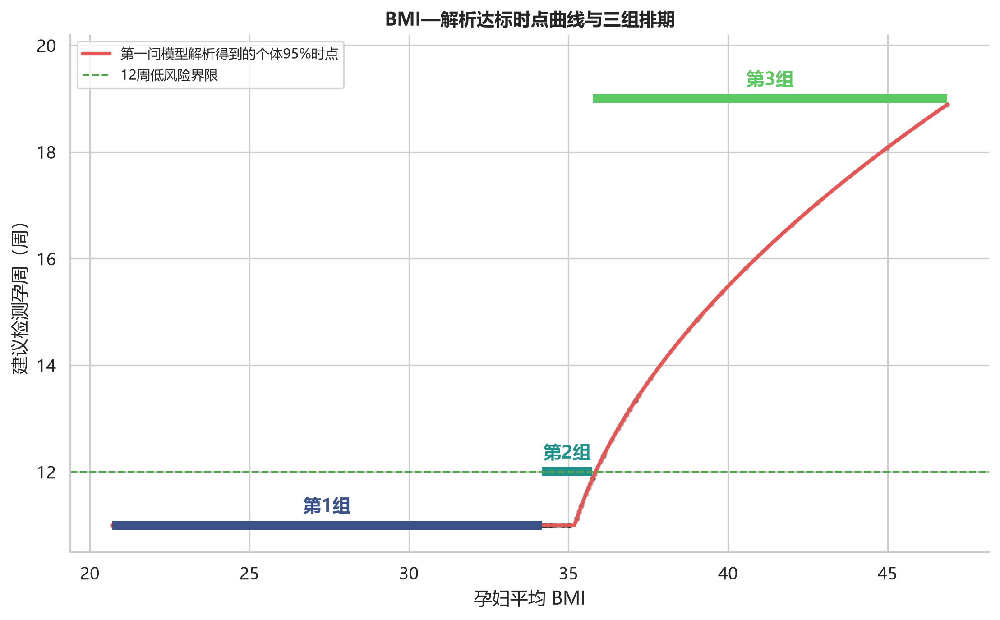
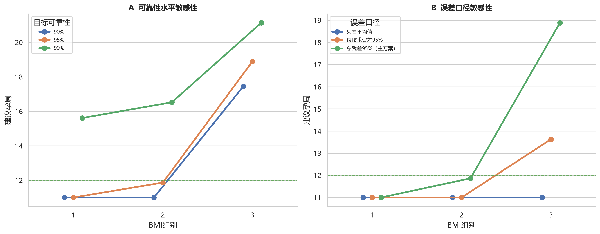

# C题第二问报告：由第一问数学模型变形求解 BMI 分组与最佳 NIPT 时点

## 摘要

本报告不另建独立的达标时间主模型，而是直接从第一问已经通过显著性与稳健性检验的 Y 染色体浓度模型出发。第一问的总体 GEE 预测式被改写为孕周 $G$ 与 BMI $B$ 的显式二次函数；再把 $P(Y\ge4\%)\ge q$ 转换为预测均值阈值，最终得到关于孕周的一元二次方程。该方程可解析求出每个 BMI 对应的最早可靠检测孕周。

以第一问残差标准差 1.260 个百分点和 95% 单侧可靠性为主方案，经连续动态分段并考虑临床排期效率，得到 3 组：BMI 20.70—34.16 建议 11周+0天，BMI 34.16—35.75 建议 12周+0天，BMI 35.75—46.88 建议 19周+0天。各时点均按组内最高 BMI 求解并向上取整到天，因此同组较低 BMI 的理论达标概率不低于表中边界概率。

## 1. 第一问模型的可求解形式

第一问最终混合模型用于区分同一孕妇内变化与孕妇间差异；但其 $\Delta G$、$G_i^B$ 和随机效应在新孕妇检测前并不完整可知，不能直接令 $\widehat Y=4$ 求绝对孕周。因此，第二问采用第一问稳健性分析中与混合模型方向一致、且能直接表示绝对孕周的总体 GEE 方程：

$$
\mu(G,B)=7.50164+1.09350\frac{G-16.8194}4
+0.271201\left(\frac{G-16.8194}4\right)^2
-0.425129\frac{B-32.2831}3.
$$

换算到原始单位：

$$
\boxed{
\mu(G,B)=7.50164+0.273376(G-16.8194)
+0.0169501(G-16.8194)^2
-0.141710(B-32.2831)
}.
$$

其中 $\mu(G,B)$ 是 Y 浓度的总体预测均值，单位为百分数。第一问中孕周一次项、二次项和 BMI 项的 $p$ 值分别为 $1.71\times10^{-33}$、$1.34\times10^{-5}$ 和 0.0132，方向为“孕周增加则浓度上升、BMI 增加则浓度下降”。在题设 10—25 周区间内，

$$
\frac{\partial\mu}{\partial G}
=0.273376+2\times0.0169501(G-16.8194)>0,
$$

所以阈值方程在可检测区间内至多有一个最早可行根。题设允许 10 周开始检测，但第一问样本最早孕周为 11 周；为避免向数据支持范围外推，本文把解析排期下限设为 11 周。

## 2. 从 4% 阈值变形为孕周方程

第一问最终混合模型的残差方差为 1.5875，故残差标准差为

$$
\sigma=\sqrt{1.5875}=1.2600.
$$

在正态近似下：

$$
P(Y\ge4\mid G,B)=\Phi\left(\frac{\mu(G,B)-4}\sigma\right).
$$

若要求达标概率至少为 $q$，等价于：

$$
\mu(G,B)\ge C_q=4+z_q\sigma.
$$

主方案取 $q=0.95$，所以 $C_{0.95}=6.0725\%$。令 $x=G-16.8194$，代入第一问模型得：

$$
0.0169501x^2+0.273376x
+\left[7.50164-0.141710(B-32.2831)-C_q\right]=0.
$$

若 11 周已经满足约束，则 $G^*(B)=11$；否则取区间内较大的根：

$$
\boxed{
G^*(B)=16.8194+
\frac{-0.273376+\sqrt{0.273376^2-4(0.0169501)c(B,q)}}
{2(0.0169501)}
},
$$

其中 $c(B,q)=7.50164-0.141710(B-32.2831)-C_q$。若求得结果超过 25 周，则记为题设检测窗口内不可满足。

## 3. BMI 分组优化

### 3.1 数据与分组目标

沿用第一问清洗后的 1064 个检测事件和 267 位孕妇。每位孕妇以多次检测 BMI 均值作为稳定 BMI；第一问已经表明孕期内 BMI 短期变化不显著，而孕妇间 BMI 差异显著。

对 267 位孕妇逐一代入解析式求 $G^*(B_i)$，按 BMI 排序后采用一维动态规划，使同组解析时点的平方误差最小，并要求每组至少 30 人。

| 组数K | 组内平方误差 | 相对最大改善率 |
|---|---:|---:|
| 1 | 334.4250 | 0.0% |
| 2 | 102.9377 | 99.8% |
| 3 | 102.4321 | 100.0% |
| 4 | 102.4321 | 100.0% |
| 5 | 102.4321 | 100.0% |
| 6 | 102.4321 | 100.0% |

纯粹按 90% 改善率规则会选 2 组；但第二组将 BMI 34.2 左右、理论上 11—12 周可完成检测的孕妇，与极端高 BMI 孕妇一起推迟到 19 周，造成不必要延误。增加第 3 组虽只进一步降低少量平方误差，却把临界人群保留在 12 周低风险界限内，因此最终采用 3 组。该选择是在统计紧凑性与题设延迟风险之间的决策优化。

### 3.2 分组结果与最佳时点

| 组别 | 人数 | BMI区间 | 最佳NIPT时点 | 边界最低达标概率 |
|---|---:|---:|---:|---:|
| 1 | 207 | [20.70, 34.16) | 11周+0天 | 96.1% |
| 2 | 30 | [34.16, 35.75) | 12周+0天 | 95.1% |
| 3 | 30 | [35.75, 46.88] | 19周+0天 | 95.3% |

每组时点由该组样本内最高 BMI 代入解析式得到，并向上取整到整天；因此不是组均值时点，而是组内保守边界时点。

## 4. 可靠性与检测误差分析

### 4.1 可靠性水平

| 组别 | 90%可靠性 | 95%可靠性 | 99%可靠性 |
|---|---:|---:|---:|
| 1 | 11周+0天 | 11周+0天 | 15周+5天 |
| 2 | 11周+0天 | 12周+0天 | 16周+4天 |
| 3 | 17周+4天 | 19周+0天 | 21周+1天 |

90%、95%、99% 分别反映不同的容错要求。可靠性越高，尤其是高 BMI 组，建议时点越晚。主报告采用 95%，在检测失败风险与延迟风险之间取较保守平衡。

### 4.2 检测误差口径

第一问 18 组技术复测估计单次技术误差标准差为 0.447 个百分点；最终混合模型残差标准差为 1.260 个百分点，后者还包含短期生物波动和未解释因素。三种口径结果如下：

| 组别 | 忽略波动 | 仅技术误差95% | 总残差95% |
|---|---:|---:|---:|
| 1 | 11周+0天 | 11周+0天 | 11周+0天 |
| 2 | 11周+0天 | 11周+0天 | 12周+0天 |
| 3 | 11周+0天 | 13周+5天 | 19周+0天 |

“只看平均值”相当于直接解 $\mu=4$，会给出过于乐观的时点；“仅技术误差”只防范实验室波动；主方案使用总残差，能同时覆盖技术误差和未解释的个体内波动，因此排期更保守。

## 5. 结果解释与执行建议

1. **第一组 BMI 20.70—34.16：** 模型在第一问数据支持下限 11 周已满足 95% 预测约束，建议 11周+0天开始检测。
2. **第二组 BMI 34.16—35.75：** 临界 BMI 的解析根接近 12 周，建议统一安排在 12周+0天，以保留在题设低风险窗口内。
3. **第三组 BMI 35.75—46.88：** 高 BMI 明显推迟达标时间；为覆盖样本上边界，建议 19周+0天。由于该组上尾样本少，可先在较早时点检测，若 Y 浓度接近 4% 或质量指标不佳，再按 19 周节点复测。
4. 检测值若落在 $4\%\pm0.447\%$ 附近，应视为阈值不稳定区，不能仅凭单次硬分类。

## 6. 模型自审查与局限性

1. 本方法严格由第一问数学模型变形而来，保证两问逻辑一致；但 GEE 是总体平均模型，不能替代个体诊断。
2. 第一问二次关系在 11—25 周内单调，因此解析求根有效；虽然题设允许 10 周检测，但本报告不向第一问样本下限 11 周以前外推。
3. 总残差的正态近似用于把连续浓度模型转成概率约束，而第一问诊断显示残差存在厚尾，因此 95% 只是模型近似可靠性。
4. 第三组跨度较大，是因为 BMI>40 的孕妇数量较少；其 19 周建议由 BMI=46.88 的样本边界决定，对多数第三组孕妇偏保守。
5. 数据存在选择性复测。GEE 关系能提供总体预测式，但不能完全消除检测计划带来的偏差，建议在外部样本上校准切点。
6. 超出样本 BMI 20.70—46.88 的孕妇属于外推，不应直接套用本分组。

## 7. 结论

第二问可由第一问模型直接变形为一元二次阈值方程。将第一问总体预测均值 $\mu(G,B)$ 与 4% 达标概率约束结合后，可解析得到最早孕周 $G^*(B)$；再对解析时点进行连续动态分段，得到三组排期：

- BMI 20.70—34.16：11周+0天；
- BMI 34.16—35.75：12周+0天；
- BMI 35.75—46.88：19周+0天。

该结果实现了从“第一问浓度关系模型”到“第二问分组决策”的完整数学闭环。主方案采用第一问总残差和 95% 单侧可靠性；临界检测结果仍应结合质量指标和复测处理。
